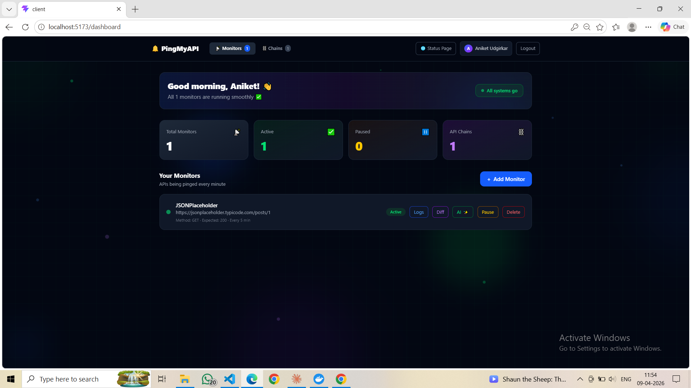
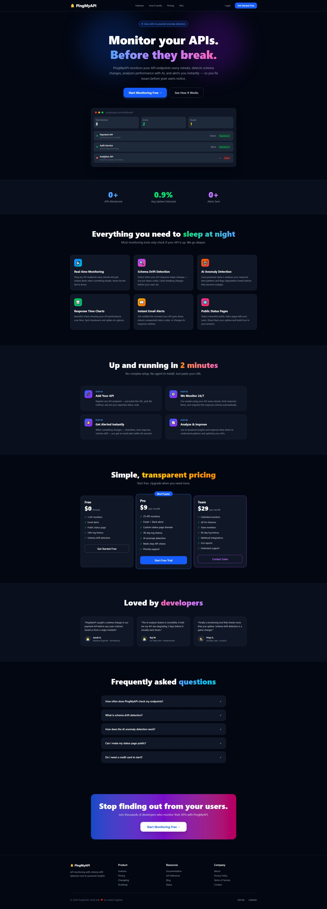
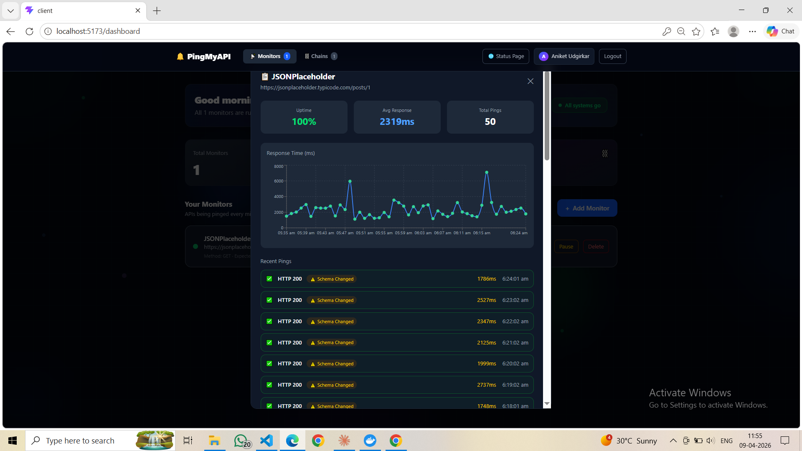
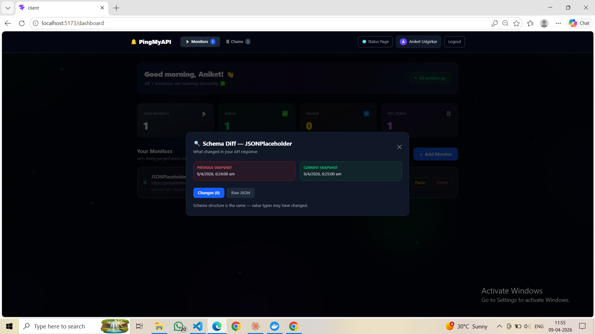
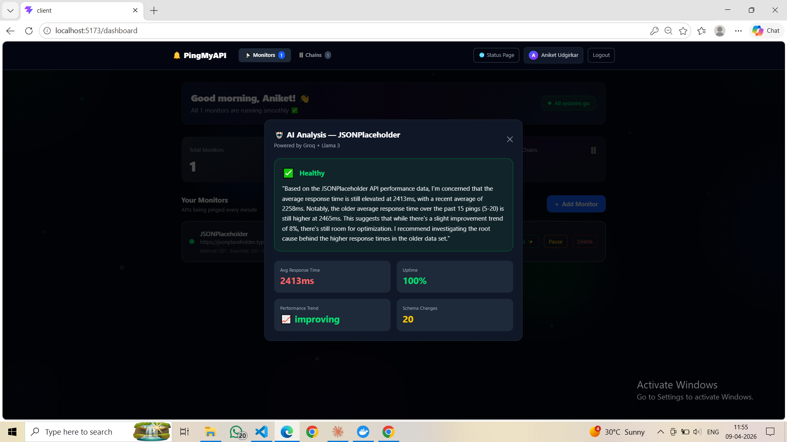
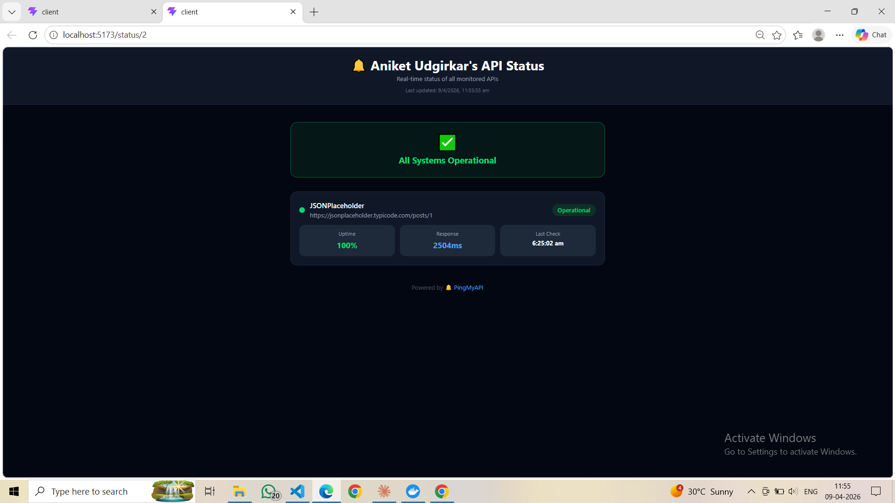
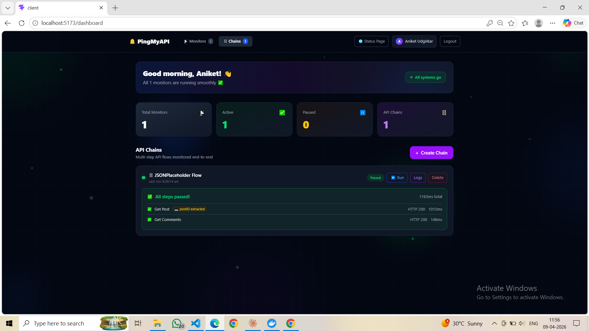

# 🔔 PingMyAPI

> API monitoring with schema drift detection, AI anomaly detection, and multi-step API chains.


## 🌐 Live Demo
**[pingmyapi.vercel.app](https://pingmyapi.vercel.app)** ← (add after deployment)

---

## 🚀 What is PingMyAPI?

PingMyAPI is a full-stack SaaS API monitoring tool that goes beyond simple uptime checks. It monitors your API endpoints every minute, detects when your response **schema changes**, analyzes performance trends with **AI**, and alerts you instantly via email — before your users notice anything is wrong.

---

## ✨ Features

| Feature | Description |
|---|---|
| 📡 **Real-time Monitoring** | Ping any API endpoint every minute automatically |
| 🔍 **Schema Drift Detection** | Detects when API response shape changes, not just status codes |
| 🤖 **AI Anomaly Detection** | Groq + Llama 3 analyzes response time trends and flags degradation |
| 📊 **Response Time Charts** | Beautiful Recharts graphs showing performance over time |
| 📧 **Instant Email Alerts** | Get notified within 60 seconds when something breaks |
| 🌐 **Public Status Pages** | Shareable status page for your users |
| ⛓️ **Multi-step API Chains** | Monitor end-to-end API flows with variable extraction |
| 🔐 **JWT Authentication** | Secure register/login with token-based auth |

---

## 🛠 Tech Stack

### Frontend
- **React** + Vite
- **Tailwind CSS v4**
- **Recharts** — response time graphs
- **React Router** — client-side routing
- **Axios** — HTTP client

### Backend
- **Node.js** + Express
- **PostgreSQL** — primary database
- **Docker** — containerized database
- **node-cron** — ping scheduler
- **JWT** — authentication
- **bcryptjs** — password hashing

### Integrations
- **Groq AI (Llama 3)** — anomaly detection
- **Resend** — transactional email alerts
- **AWS EC2** — cloud deployment

---

## 📸 Screenshots

### Landing Page


### Dashboard


### Response Time Chart + Logs


### Schema Diff Viewer


### AI Analysis


### Public Status Page


### API Chains


---

## ⚙️ Local Setup

### Prerequisites
- Node.js v18+
- Docker Desktop
- Git

### 1. Clone the repo
```bash
git clone https://github.com/aniket2832/pingmyapi.git
cd pingmyapi
```

### 2. Start the database
```bash
cd server
docker compose up -d
```

### 3. Setup environment variables
Create `server/.env`:
```env
PORT=5000
DB_HOST=localhost
DB_PORT=5432
DB_USER=admin
DB_PASSWORD=admin123
DB_NAME=pingmyapi
JWT_SECRET=your_secret_key
GROQ_API_KEY=your_groq_key
RESEND_API_KEY=your_resend_key
```

### 4. Initialize database
```bash
Get-Content db/schema.sql | docker exec -i pingmyapi_db psql -U admin -d pingmyapi
```

### 5. Start the backend
```bash
npm install
npm run dev
```

### 6. Start the frontend
```bash
cd ../client
npm install
npm run dev
```

Visit `http://localhost:5173` 🚀

---

## 🏗 Architecture
pingmyapi/
├── client/                 # React frontend
│   ├── src/
│   │   ├── pages/          # Login, Register, Dashboard, Landing, StatusPage
│   │   ├── components/     # EndpointCard, LogsModal, DiffModal, AIModal, ChainCard
│   │   ├── context/        # AuthContext
│   │   └── api/            # Axios instance
│   └── ...
└── server/                 # Node.js backend
├── controllers/        # authController, endpointController, aiController, chainController
├── routes/             # auth, endpoints, logs, ai, chains
├── middleware/         # JWT auth middleware
├── workers/            # pingWorker (cron job)
├── db/                 # PostgreSQL pool + schema
└── index.js

---

## 🔑 Key Technical Decisions

- **Schema drift detection** — Extracts and compares JSON response structure using recursive key traversal, not just value comparison
- **AI analysis** — Sends last 20 ping results to Groq's Llama 3 with engineered prompt for actionable insights
- **Variable extraction in chains** — Uses dot-path notation to extract values from responses and inject them into subsequent requests via `{{variable}}` syntax
- **Cron worker** — Runs every minute, fetches all active endpoints with user emails in a single JOIN query for efficiency

---

## 👨‍💻 Author

**Aniket Udgirkar**
- GitHub: [@aniket2832](https://github.com/aniket2832)
- LinkedIn: [aniket-udgirkar](https://www.linkedin.com/in/aniket-udgirkar/)

---

## 📄 License

MIT License — feel free to use this project for learning or inspiration!